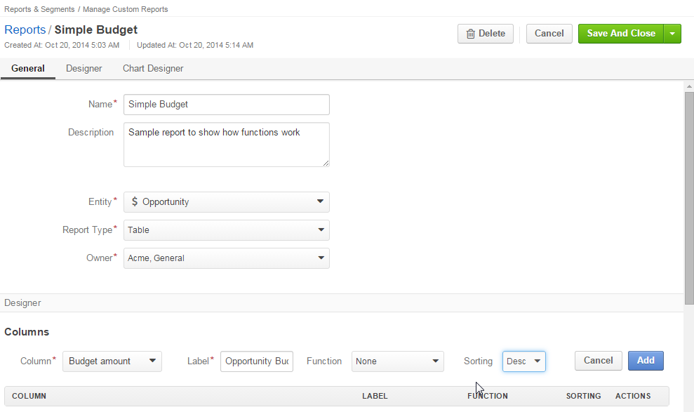

Reports
=======

The three main thing to say about reports functionality (as well as about the whole Oro Platform-based OroCRM 
application are **flexible**, **adjustable** and *scalable**.
In other words, you can create almost any kind of report to process the details of both system and custom Entities (i.e.
those that come with the System initially and those created for specific need of your business).

Creating a Report
-----------------
If you feel a need to systematize the information available for the instances of a specific Entity defined in the 
system, you can always do so with a report.
To create a report, go to *Reports and Segments -->  Manage Custom Reports* and click :kbd:`Create Report` button.

*Create Report* page will appear.

For each report there are three major section of properties:
1. General: general information
2. Designer: information processed, the way of analysis and filter available for the table
3. Chart Designer: Chart Settings

.. _user-guide-reports-general-report-settings:

*General Report Setting*
------------------------

The following fields are mandatory and **must** be defined for a report.

.. csv-table:: **General Report Fields**
  :header: "Field","Description"
  :widths: 10, 30

  "**Name***","The name is used to refer to the Report in the future.
  It is recommended to keep the name meaningful for you."

   "**Entity***","The Entity, details whereof shall be processed by the report. This can be any system or custom Entity 
  pre-populated into the system.

  Click |Bdropdown| button to choose one of available Entities. (Both system and custom Entities will be displayed 
  in the alphabetic order). You can also start typing the Entity name in the text field to find it faster."
       
   "**Report Type***","This is a drop-down that will soon be filled with different types of reports. Meanwhile, OroCRM 
  1.4 support only table reports - this is the first type of reports implemented, and the most commonly used for CRM 
  needs.
   
  Click |Bdropdown| button and choose *Table*"

  "**Owner***","This field limits the list of Users authorized to manage the Report created. 

  Once the Owner is chosen, only the Users, authorized to manage Reports of the Owner (Organization) and Users that can 
  manage Reports that belong to such Users (e.g. System administrator) can do so."

The only optional system field is *Description*. For the convenience of use, it is recommended to fill the field with a 
brief description of the Report aims and targets.

*Designer*
----------

In the Designer section you build the structure of your report.

|Designer|

There are two main sections:
- **Columns**: defines the columns of your report and information displayed therein and
- **Grouping**: defines how details of the report will be grouped in the rows

Columns
^^^^^^^

*Column Fields*
^^^^^^^^^^^^^^^

For each column there are:

.. csv-table:: **Column Settings**
  :header: "Field","   Description"
  :widths: 10, 30

  "**Choose a field*** drop-down:","Choose a field from which raw data will be taken. This can be a field of the Entity
  the Report is created for or of a Related Entity. All the fields available will appear in the  drop-drop-down list. 
  
  To choose a property of a Related Entity, choose an Entity from the list, and its Field will appear in the 
  drop-down."

  "**Label***","A free text field that defines how the field chosen at the previous step will be referred to in the 
  report. 
  
  The field is automatically field by the label chosen for the field in the system settings, but may be edited subject 
  to the specific report needs."     
              
  "**Function***","A function to perform with the field values. You will only see the functions available for the field
  chosen. 
  There are some filed specific functions (e.g. *Won Count* that shows the number of *Won* Opportunities for the 
  *Opportunities --> Status* field. Description of some of the most common function and relevant examples are 
  provided below.
   
  Available functions are:
   
  - *None*: no function applied. The data will be displayed for all the available instances of the Entity
   
  - *Count*: you will see the number of possible values of the field for all the instances of the Entity
   
  - *Sum*: the field values for all the instances of the Entity will be summed up
    
  - *Average*: the arithmetical mean of the field values for all the instances against the amount of instances will be 
    displayed.
    
  - *Min*: only the smallest of all the field values for all the instances will be displayed.
   
  - *Max*: only the largest of all the field values for all the instances will be displayed."
   
  "**Sorting***","defines the way values of the field or their functions are displayed in the report.
   
  - *None*: no sorting applied 
  - *Asc*: ascending
  - *Desc*: descending"

   
*Changing Column Fields*
^^^^^^^^^^^^^^^^^^^^^^^^     
    
Once you have specified the settings for a column element click :kbd:`Add` button, and the field you have defined will 
appear in the "COLUMN" grid.

Now you can: 
- |IcEdit| : edited
- |IcDelete| : delete or 
- |IcMove| : move 
the column in the report. 

**Columns. Report Examples** 
^^^^^^^^^^^^^^^^^^^^^^^^^^^^

For the sake of example we have created a very simple report of one field. It will contain only budget amount details. 
(This is not too meaningful but will be a great illustration of how functions influence the report data)

- General:
  - Name: Simple Budget
  - Entity: Opportunity
  - Report Type: Table
  - Owner: Organization of the User creating the report.

 - Column 1:
   - Field: Budget amount
   - Label: Opportunity budget
   - Function: None
   - Sorting: Desc
 
Click :kbd:`Add` button to add the settings into the *Columns* grid. Click :kbd:`Save and Close` to save the Report in 
the system and view it.

You would see something of the kind:

|RepEx1a|

There are 75 Opportunity instances, an the values defined in the *Budget Amount* field of each and every of them will be
displayed in the Report.

Click :kbd:`Edit` to return to the Report settings. Let's see, how the report changes, if we apply different Functions 
to the *Opportunity Budget* field. Click |IcEdit| icon and change the column settings. 
(Don't forget to click :kbd:`Save`).

**Function = Count**

|RepEx1b| 

There are 43 different values of the *Budget Amount* field for all the Entity instances in the System.

**Function = Sum**

|RepEx1c| 

The sum of all the values of the *Budget Amount* fields for all the Entity instances in the System makes 
$202,565.00.

**Function = Average**

|RepEx1c|

The arithmetic mean of all the values of the *Budget Amount* fields for all the Entity instances in the System
makes 4,710.81 

**Function = Min**

|RepEx1d| 

The smallest Budget amount value available in the system is $121.00

**Function = Max**

|RepEx1e| 

The biggest Budget amount value available in the system is $9,902.00

Grouping
^^^^^^^^

Grouping section provides for more complex and informative reports. Once you have added a field in the *Grouping* 
section you will see all the columns values or their functions for a set of all the entity instances with the same 
*grouping* field value.
For example, you can see a total, average maximum and minimum budget amount for all the Opportunities with the same 
Status.

..caution :: 

    You have to add the field(s) grouping is made by to the *COLUMN* section.

**Grouping. Report Example 1** 
^^^^^^^^^^^^^^^^^^^^^^^^^^^^^^

Let's create such a report.

- General:
  - Name: Budget per opportunity status
  - Entity: Opportunity
  - Report Type: Table
  - Owner: Organization of the User creating the report.

 - Column 1:
   - Field: Status
   - Label: STATUS
   - Function: None
   - Sorting: None

   (usually it is rather convenient to have the column sorting is made by first)

 - Column 2:
   - Field: Budget amount
   - Label: BUDGET TOTAL
   - Function: Sum
   - Sorting: None

   (we used the Sum function to see the total budget for all the Opportunities in the group)
   
 - Column 3:
   - Field: Budget amount
   - Label: BUDGET AVARAGE
   - Function: Average
   - Sorting: None

 - Column 4:
   - Field: Budget amount
   - Label: BUDGET MIN
   - Function: Min
   - Sorting: None

   (we will sew the smallest budget of all the opportunities with the status)

 - Column 5:
   - Field: Budget amount
   - Label: BUDGET MAX
   - Function: Max
   - Sorting: None
   
|RepEx2|

Here is what we have got:

|RepEx2a|

Several Level Grouping with Example
^^^^^^^^^^^^^^^^^^^^^^^^^^^^^^^^^^^

You can also group instances inside a group. For example, we can add one more grouping field (Customer name) to our 
report, and see the budget function values for all the Opportunities with the same Status the belong to specific 
Customer.

|RepEx3|

No you will see the data for all the In Progress Opportunities of one Customer, than of another Customer, etc. Only then
you will see data for all the Won Opportunities of each Customer, etc.

|RepEx3a|

.. hint::

    One a report has been generated, you can click on the name of a column, to sort all the data in the report by the
    specified fields' value (ascending or descending).

Let' order our report by the Customer names. That is what we will get

|RepEx3b|

As you can see in the circled area, for Albers Super Markets there are Opportunity instances that are in progress and 
that were lost. You can view the budget details for the both groups.

.. note::
    
    If the Customer's name is the most important part of the grouping, it might be reasonable to edit the report and 
    move the column to make it first.

    
*Filters*
---------

With the *filters* section you can choose the set of columns processed more specifically. You can do so with

- Field Condition: a specific condition laid over a values of the specific field such only instances that meet the 
  condition are included in the report

- Conditions Group: a specific set of condition laid over a values of the specific field such only instances that meet 
  the condition are included in the report

- Apply segment: settings of a specific :term:`segment` are applied to the instances (Segments are subject to a separate
  document)

 
Filters Examples
^^^^^^^^^^^^^^^^

For example, we want to see our report for Opportunity instances with all the Statuses but "Won"  

- Drag the **Field Condition** to the Filter list to specify the settings of instances that shall or shouldn't be included
  to the report.

  |RepExFilter1|

- Click *Choose a field* link and choose the field from a drop-down. (For our example we need the Status field*)

  |RepExFilter2|

- Click the *contains* link in the *field value contains* if you need to change the condition.

  |RepExFilter3|

- For our example we have chosen "does not contain" condition and *Lost*.

Now no Lost Opportunities are displayed in the report:

|RepExFilter4|

You can also apply a group of conditions. - For our example let's exclude all the Opportunity instances that are in 
progress, and were created after the start of the year and their budget field is not empty

and all the Opportunity instances Closed before year 2014 or

- Drag the first Condition field and define the condition for the status

- Drag the **Condition Group** to the filter list below the first condition. 

  |RepExFilter5|

- Define the conditions.
 
 |RepExFilter6|

*Chart*
-------

OroCRM 1.4 support line charts. To create a line chart for the report, go to the **Chart** and define the following 
fields (all the fields are mandatory and **must** be defined)

.. csv-table:: **ChartSettings**
  :header: "Field","Description"
  :widths: 10, 30

  "**Chart Type***:","Currently only *Line Chart* option is available"
  
  "Category (X Axis):","Choose the fields, values whereof will form the X Axis of the report chart"
  
  "Value (Y Axis):","Choose the fields, values whereof will form the Y Axis of the report chart"

*Chart Example*
--------------_

Let's make a chart for the Budget per opportunity status report (not grouped by customers). 

- Category is Status
- Value is Budget amount (the one that corresponds to the Budget Average label)

|RepExChart1|

That's what we have got:

|RepExChart2|

.. |Bdropdown| image:: ./img/buttons/Bdropdown.png
   :align: middle

.. |IcEdit| image:: ./img/buttons/IcEdit.png
   :align: middle
   
.. |IcDelete| image:: ./img/buttons/IcDelete.png
   :align: middle
   
.. |IcMove| image:: ./img/buttons/IcMove.png
   :align: middle
      

   

.. |RepEx1a| image:: ./img/reports/Screenshots/RepEx1a.png
   :width: 75 %
 

   
.. |RepEx2| image:: ./img/reports/Screenshots/RepEx2.png
   :width: 100 %

.. |RepEx2a| image:: ./img/reports/Screenshots/RepEx2a.png
   :width: 100 %

.. |RepEx3| image:: ./img/reports/Screenshots/RepEx3.png
   :width: 100 %
   
.. |RepEx3a| image:: ./img/reports/Screenshots/RepEx3a.png
   :width: 100%
   

   

   

   

   

   

   
.. |RepExFilter6| image:: ./img/reports/Screenshots/RepExFilter6.png
   :width: 100 %

.. |RepExChart1| image:: ./img/reports/Screenshots/RepExChart1.png
   :width: 100 %

.. |RepExChart2| image:: ./img/reports/Screenshots/RepExChart2.png
   :width: 100 %